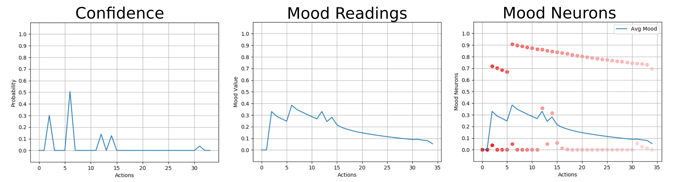
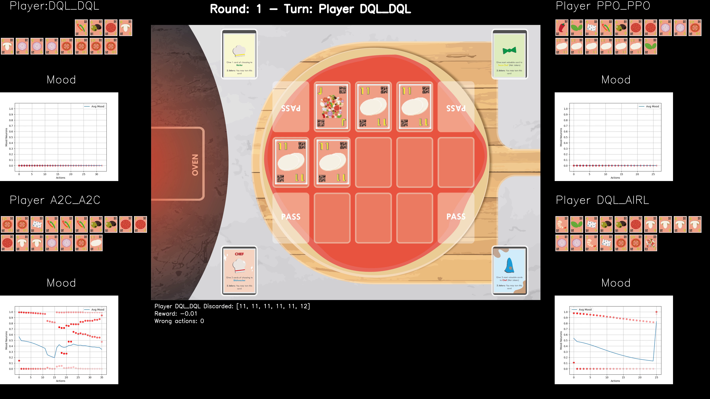

This repository holds the implementation of the Moody Framework for the Chef's Hat Card Game Simulation.

## Moody Framework

The Moody framework allows an agent playing the Chef's Hat Card game to ge\emph nerate a self-assessment
of its own confidence while playing the game, as well as estimated confidences
of all of its opponents.

The confidences are represented as an intrinsic state, the Mood, and are used to explain how
each of the agents are performing while
playing the game.

It builds on the phenomenological confidence representation of the Q-values selection and implements a Growing-When-Required (GWR) network to establish a temporal impact between the taken actions. Also, the model allows each agent to measure their opponents' actions based on their own assessing, endowing them with a closed-world representation of the entire game.

#### Chef's Hat Card Game Simulation

Chef's Hat is a competitive card game  designed with specific HRI requirements in mind, which allows it to be followed and modeled by artificial agents with ease. The game mechanics were designed to evoke different social behavior between the players. 
Fora a complete overview on the development of the game, refer to:

- The Chef's Hat Simulation Environment for Reinforcement-Learning-Based Agents (https://arxiv.org/abs/2003.05861)
- The Chef's Hat Simulation Environment Repository: https://github.com/pablovin/ChefsHatGYM


## The Moody Framework Plugin

#### Mood Plugin
The Moody Framework implementation is made to be used as a Plugin to the Chef's Hat Simulation environment.
Every agent implemented by the simulation environment can be enhanced with a Moody plugin, allowing it to explain
its own behavior.

Each plugin is able to generate a mood network for each agent and its opponents. You can define this
at the agent instantiation phase:

```python
From Mood.Intrinsic import Intrinsic

intrinsicWithMoodDQL = Intrinsic(
selfConfidenceType=CONFIDENCE_PHENOMENOLOGICAL, 
isUsingSelfMood=True,
isUsingOponentMood=True
)
```

and you can add a plugin to one agent:

```python
agent1 = AgentDQL.AgentDQL([False, 1.0, "DQL", intrinsicWithMoodDQL]) #training agent
```

#### Online Update of the Mood

For each action an agent performs (self-observation):

```python
self.agent.intrinsic.doSelfAction(qValues) 
```
Everytime an agent finishes a game (self-observation):

```python
self.intrinsic.doEndOfGame(score, thisPlayerIndex)
```

Everytime another agent perform an action (opponent estimation):

```python
action, actionType, board, boardAfter,possibleActions, 
cardsInHand, thisPlayer, myIndex, done, score = params
observeOponentAction(self, params, QModel)
```
#### Offiline Mood

The Moody framework is also able to generate the self and estimated Moods based on 
recorded games. For that, it uses a 
Using a Chef's Hat simulation dataset.

- run_MoodFromDataset.py - Example on how to create Moods Offline.

The mood will be saved as a dataset (.pkl format), which allows it to be postprocessed at any time.


#### Mood Plots

The Moody framework adds to the Chef's Hat Simulation the following plots:

 
- "Experiment_Mood" - The mood reading for all the self and opponent's estimations.
- "Experiment_MoodNeurons" - The mood readings, together with the individual neuron readings, for all the self and opponent's estimations.
- "Experiment_SelfProbabilitySuccess" - The self and opponent's estimation confidence probabilities for each action.
 
##### Videos

The Moody framework adds to the Chef's Hat Simulation the abillity to generate
videos with the MoodNeurons plot. 

- run_CreateVideoFromDataset.py - Example on how to create videos with the Mood readings.
 
Click on the video bellow to see an example:
 
  [](https://www.youtube.com/watch?v=uRyfbktynT0&t=42s)
 
 
## Use and distribution policy

All the examples in this repository are distributed under a Non-Comercial license. If you use this environment, you have to agree with the following itens:

- To cite our associated references in any of your publication that make any use of these examples.
- To use the environment for research purpose only.
- To not provide the environment to any second parties.

## Citations

- Barros, P., Sciutti, A., Hootsmans, I. M., Opheij, L. M., Toebosch, R. H., & Barakova, E. (2020). It's Food Fight! Introducing the Chef's Hat Card Game for Affective-Aware HRI. Accepted at the HRI2020
  Workshop on Exploring Creative Content in Social Robotics! arXiv preprint arXiv:2002.11458.

- Barros, P., Sciutti, A., Hootsmans, I. M., Opheij, L. M., Toebosch, R. H., & Barakova, E. (2020) The Chef's Hat Simulation Environment for Reinforcement-Learning-Based Agents. arXiv preprint arXiv:2003.05861.

- Barros, P., Tanevska, A., & Sciutti, A. (2020). Learning from Learners: Adapting Reinforcement Learning Agents to be Competitive in a Card Game. arXiv preprint arXiv:2004.04000.

## Contact

Pablo Barros - pablo.alvesdebarros@iit.it

- [http://pablobarros.net](http://pablobarros.net)
- [Twitter](https://twitter.com/PBarros_br)
- [Google Scholar](https://scholar.google.com/citations?user=LU9tpkMAAAAJ)
